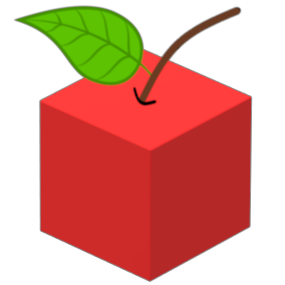

   <h1 align="center"> Save It </h1>

## Intro: What is SaveIt?
On a daily basis, food in many restaurants are often thrown out in large quantities, which results in immense food wastage. More than 80% of food in wasted in the US alonel; the numbers globally must be frightening. What if this food could be used before it expires? That's where **Save It** comes in. **Save It** allows food companies to donate their unsold food before it expires. This food will be transported and distributed to people in need and donators can fund these transports with ETH!

## Technologies Used (most detailed para)

### (elaborate and expand this section)

1. Install dependencies with yarn or npm
2. Test/Run the smart contracts
3. Deploy the smart contracts on a local or test network 
4. Connect the frontend to the smart contracts
5. Run the frontend
6. Interact with the smart contract
7. Save the world

---

#### -> Setup: How to run the app
(The code snippets to run on the terminal)

---

## -> Maybe talk about what this dapp is helping us achieve and why did we implement it on blockchain

---

## -> Languages and Frameworks Used
This project consists of 2 main components, the ***contract*** side and the ***client*** side of the dapp. A package manager like yarn or npm is used to install the dependencies needed for this project.

For the contract side, Solidity was used to write the smart contracts, and the development environment framework of choice was Hardhat. Hardhat was used to test, as well deploy the smart contracts on the local network and testnet. 

For the client side, we used React, Bootstrap, and Web3UIKit to build the frontend. JavaScript, HTML, and CSS were used to style the frontend.

---
## -> Chainlink services and their purpose in the project

### (elaborate and expand this section)

1. Data Feeds
2. Verifiable Random Function
3. Keepers

---

## Our goal
We recognize the persisting global issue of food wastage and the potential that blockchain technology
has for providing the reassurance that an action taken will be seen through till the end. Every small food donation made will truly have an influence in reducing food wastage.

---
---

## Inspiration
Food wastage is an widely apparent issue around the world. On a daily basis, food in many restaurants is often thrown out in large quantities, which results in immense food wastage. More than 80% of food in wasted in the US alone... the global numbers must be frightening! What if there was a way to dramatically reduce food wastage? What if this food could be used before it gets expired and thrown out? That's where Save It comes in. Save It lets food companies and organizations donate their unsold food before it expires and gets tossed out. This food will be transported and distributed to people in need. The transportation and distribution of this food will be funded by donators who donate to the smart contract. 

Donators automatically get entered into a decentralized lottery and a random winner gets selected every month. And the prize? Free food for a day!
